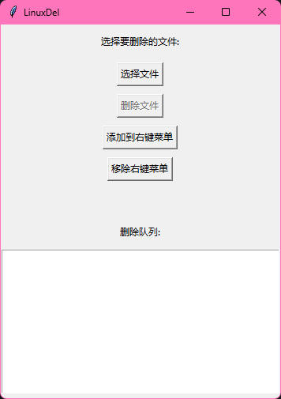

# LinuxDel 文件粉碎工具



## 功能特性
🐾 安全彻底的文件删除算法
🐈 右键菜单快速删除集成
🔒 管理员权限自动获取
📜 详细的日志记录功能

## 安装说明
```bash
# 克隆仓库
git clone https://github.com/jimmy32767255/LinuxDel.git

# 安装依赖
pip install -r requirements.txt
```

## 使用方法
### 命令行模式
```bash
python main.py /path/to/file
```

### 图形界面模式
1. 运行 `python main.py`
2. 点击"选择文件"按钮
3. 确认后点击"删除文件"

### 右键菜单集成
🐱 点击"添加到右键菜单"按钮安装
🐾 点击"移除右键菜单"按钮卸载

## 技术实现
- 使用Windows注册表操作实现右键菜单
- 通过`winreg`模块管理注册表项
- 采用管理员权限提升机制

## 贡献指南
欢迎提交PR或Issue喵~ (≧◡≦)

## 许可证
[MIT License](LICENSE)